<div align="center">


[](https://git.io/typing-svg)

</div>

---

## `whoami`

```bash
$ cat /etc/profile.d/adrian.conf

NAME="Adrian Leon"
ROLE="SOC Analyst / Blue Team Engineer"
LOCATION="México 🇲🇽"
FOCUS="Threat Detection · Incident Response · SIEM Engineering"
CURRENT_PROJECT="Home SOC Lab — attack, detect, document, repeat"
MINDSET="If you want to defend it, you need to know how to break it."
```

Trabajo en el lado defensivo de la ciberseguridad con experiencia práctica en detección de amenazas, análisis forense, administración de SIEM y respuesta a incidentes en entornos enterprise multi-tenant. Creo que el mejor Blue Teamer entiende el ofensivo tan bien como el defensivo — por eso ataco mi propio lab.

---

## 🧱 Stack

<div align="center">

**SIEM & Detection**


**Cloud & Identity**


**Offensive (for better defense)**


**Scripting & Automation**


</div>

---

## 🏗️ Home SOC Lab

> Entorno personal de ataque, detección y análisis — construido para aprender haciendo y documentar cada escenario.

<div align="center">



</div>

**Objetivos del lab:**
- Simular TTPs reales mapeadas a MITRE ATT&CK framework
- Crear y afinar reglas de detección custom en Wazuh
- Documentar cada escenario: ataque → alerta → análisis → write-up
- Preparación práctica para certificaciones Blue Team

📂 **[Ver el proyecto completo →](https://github.com/TheAdriansher/snoopy-soc-lab)**

---

## 📂 Proyectos

| Proyecto | Descripción | Stack |
|----------|-------------|-------|
| 🔬 **[snoopy-soc-lab](https://github.com/TheAdriansher/snoopy-soc-lab)** | Home SOC Lab — detección, análisis forense, threat hunting y write-ups por escenario | `wazuh` `ubuntu-server` `kali` `mitre` |
| 📓 **[HTB_Vault](https://github.com/TheAdriansher/HTB_Vault)** | Write-ups de máquinas, Sherlocks y challenges de HackTheBox | `htb` `ctf` `forensics` `pentesting` |

---

## 🏅 Certifications

<div align="center">

| | Certificación | Issued by | Estado |
|--|---------------|-----------|--------|
| 🟢 | **eJPT v2** | eLearnSecurity / INE | ✅ Passed — 2026 |
| 🟢 | **HTB CJCA** | HackTheBox | ✅ Passed — 2026 |
| ⚔️ | **HTB Hacker Rank** | HackTheBox | 🔄 Activo |
| 🔵 | **BTL1** | Security Blue Team | 📍 Roadmap |
| 🔵 | **CompTIA Security+** | CompTIA | 📍 Roadmap |

</div>

---

## 📊 Stats

<div align="center">


</div>

<div align="center">

[](https://git.io/streak-stats)

</div>

---

## 🌐 Connect

<div align="center">

[](https://www.linkedin.com/in/adrianleonvalencia)
[](https://app.hackthebox.com/profile/2149173)
[](https://github.com/TheAdriansher)

</div>

---

<div align="center">


*"The quieter you become, the more you are able to hear."*

</div>
